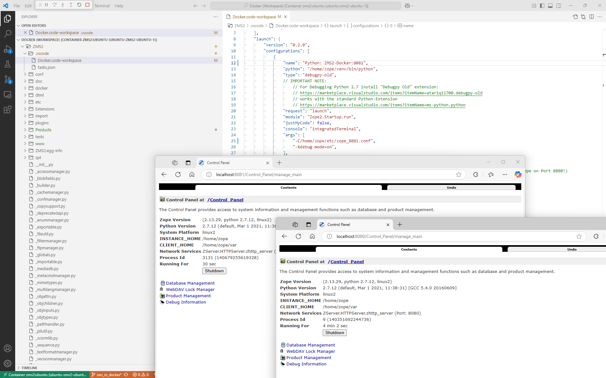

# Running ZMS2 on Python2 in a Docker container with Ubuntu 16.04

Important: *The here presented Docker environment is not recommended for production, just for testing and exploration.*

The ZMS source folder `./docker` contains a minimalistic Docker file: 
1. the [dockerfile](https://github.com/zms-publishing/ZMS2/blob/master/docker/ubuntu/dockerfile) for creating a Docker *image* and 
2. the [docker-compose](https://github.com/zms-publishing/ZMS/blob/master/docker/ubuntu/docker-compose.yml) file for building a Docker *container*.

The Docker image utilizes a minimal *Ubuntu 16.04*-Linux with a fresh compiled Python3 and some additional software packages (like mariadb and openldap). The ZMS installation happens with pip in a successively created virtual python environment (`/home/zope/venv`) and provides the ZMS code in the pip-"editable" mode from the ZMS source code folder (`/home/zope/venv/src/ZMS/.git`) whereas the Zope instance is placed in the home folder (`/home/zope/`)

To make Zope running there are some crucial config files needed which usually (created by `mkzopeinstance`) are set on default values. In a Docker environment these defaults must be modified; moreover the Docker container provides a ZEO-server for running multiple Zope processes in parallel (e.g. an additional one for debugging). That is why a small set of config files is provided as presets via the the source-folders
1. ./docker/ubuntu/bin
2. ./docker/ubuntu/etc
3. ./docker/ubuntu/var
4. ./docker/ubuntu/Extensions

These sources will be copied into the *image* (on building) 
```yaml
# dockerfile
COPY ./bin bin
COPY ./var var
COPY ./etc etc
COPY ./Extensions Extensions
```
or referenced as *volume mounts* from the *container* (on composing):
```yaml
# docker-compose
    volumes:
      - ./bin/:/home/zope/bin/
      - ./etc/:/home/zope/etc/
      - ./var/:/home/zope/var/:rw
      - ./Extensions/:/home/zope/Extensions:rw
```

## Overview of Docker- and all Zope config-files

*Hint: to ease the file access from the container the config files are not restricted:* `chmod -r 777`
```
$ tree -p
.
├── [-rw-r--r--]  docker-compose.yml
├── [-rw-r--r--]  dockerfile
├── [drwxrwxrwx]  Extensions
├── [drwxrwxrwx]  etc
│   ├── [-rwxrwxrwx]  runall
│   ├── [-rwxrwxrwx]  zeo.conf
│   ├── [-rwxrwxrwx]  zope_8080.conf
│   └── [-rwxrwxrwx]  zope_8081.conf
└── [drwxrwxrwx]  var
    ├── [drwxrwxrwx]  cache
    ├── [drwxrwxrwx]  log
```

## Crucial Config Parameters for Managing ZODB-Access with ZEO 

IMPORTANT HINT: _These configurations fit to the old Python2/Zope2 environment_

ZEO allows running multiple Zope instances accessing one ZODB data-file. The crucial configuration parameters are

### 1. zeo.conf

zeo.conf sets the port and the location on which the Zope instances get access to the ZODB data-file.

```xml
<zeo>
    address 8100
</zeo>

<filestorage main>
    path $INSTANCE/var/Data.fs
</filestorage>
```

### 1. zope.conf: Each for any Zope-instance/port 

In Zope2 the port is set in xml-style so that for running a different Zope instance on a different port a copy of the  zope.conf is needed for setting the specific  `http-server.address`.
For telling Zope how to adresse the Zope-database (ZODB) the `zodb_db`-element is nesting an additional `zeoclient`-element that defines the final _routing_ to the ZODB. 

```xml
<http-server>
  address 8080
</http-server>

<zodb_db main>
    mount-point /
    <zeoclient>
        server 127.0.0.1:8100
        storage main
        name maintorage
        var $INSTANCE/var
        cache-size 100MB
    </zeoclient>
</zodb_db>
```


## Running the ZMS Container with VSCode

The VSCode Docker Extension [ms-azuretools.vscode-docker](https://marketplace.visualstudio.com/items?itemName=ms-azuretools.vscode-docker) is a perfect tool for handling containers. A right mouse click on the file ´docker-compose.yaml´ starts composing the container. Initially ZEO will be started and Zope will run on port 8080.


## Attach VSCode to the ZMS Container
Another right click on the running container-ID allows to intrude the container with VSCode and launch a new Zope instance in debugging mode. 
Hint: For this purpose the docker-container folder `/home/zope/venv/src/zms/.vscode/` contains a prepared VSCode-workspace file and a launch file for starting Zope in debug-mode within the container [Docker.code-workspace](../../.vscode/Docker.code-workspace). The thus launched Zope instance will run port 8081.
For Debugging Python 2.7 install from VSCode Marketplace the [Debugpy Old](https://marketplace.visualstudio.com/items?itemName=atariq11700.debugpy-old) extension into the container. The "Debugpy Old" extension actually works with the current [Python-Extension](https://marketplace.visualstudio.com/items?itemName=ms-python.python) that shall be installed as a second step. The debugger rucan be started from delivered workspace-file as "Python: ZMS2-Docker:8081"-configuration



